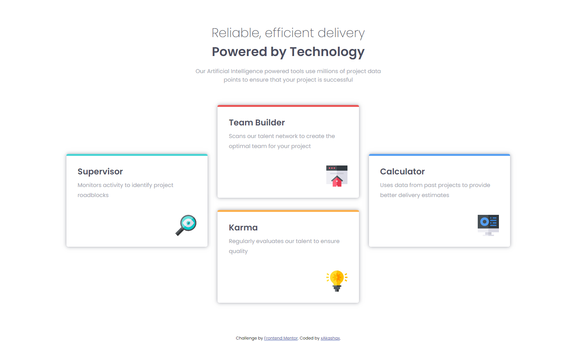
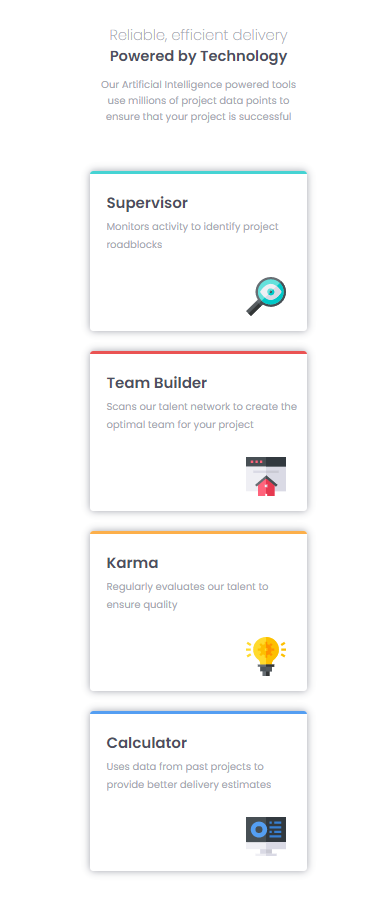

# Frontend Mentor - Four card feature section solution

This is a solution to the [Four card feature section challenge on Frontend Mentor](https://www.frontendmentor.io/challenges/four-card-feature-section-weK1eFYK). Frontend Mentor challenges help you improve your coding skills by building realistic projects. 

## Table of contents

- [Overview](#overview)
  - [The challenge](#the-challenge)
  - [Screenshot](#screenshot)
  - [Links](#links)
- [My process](#my-process)
  - [Built with](#built-with)
- [Author](#author)

## Overview

### The challenge

Users should be able to:

- View the optimal layout for the site depending on their device's screen size

### Screenshot

Desktop

Mobile

- Solution URL: [Frontendmentor.io](https://www.frontendmentor.io/solutions/four-card-feature-section-using-flex-and-position-absolute-B1NoGZ-7q)
- Live Site URL: [Live Demo](https://grand-vacherin-3c140a.netlify.app/)

## My process

### Built with

- Semantic HTML5 markup
- CSS custom properties
- Flexbox
- Position: Absolute
- Mobile-first workflow

## Author
- Frontend Mentor - [@xAkashax](https://www.frontendmentor.io/profile/xAkashax)

